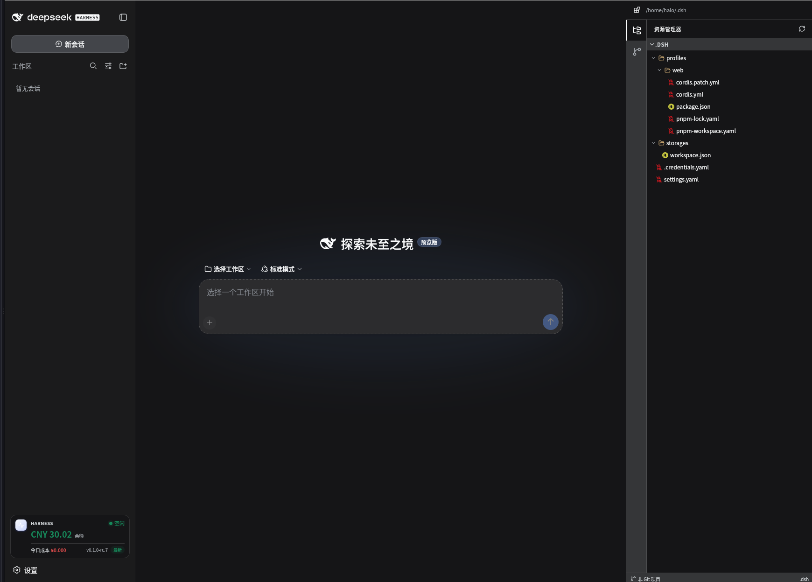
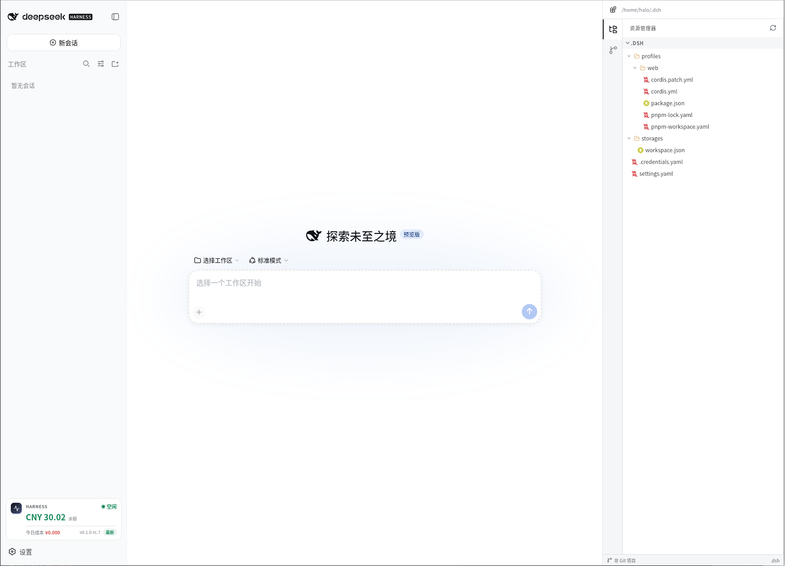

# dsh-workspace

> **Unofficial** — an independent community project, not affiliated with or endorsed by DeepSeek.
> Fork of [deepseek-dsh/dsh-workspace](https://github.com/deepseek-dsh/dsh-workspace), trimmed and fully translated to English.

[](https://github.com/mainzerp/dsh-workspace/releases)
[](https://github.com/mainzerp/dsh-workspace)
[](https://github.com/mainzerp/dsh-workspace)

> A drop-in UI enhancement for DeepSeek Harness (DSH): a subtle USD balance with peak/off-peak indicator in the sidebar, a project file tree with previews, Git changes & history, and a built-in terminal — no extra config.

[Features](#features) · [Screenshots](#screenshots) · [Differences from upstream](#differences-from-upstream) · [Install](#install) · [Configuration](#configuration) · [FAQ](#faq) · [Known limitations](#known-limitations) · [License](#license)

## Screenshots





## Features

**Usage at a glance**

- Subtle live balance (USD, formatted via `Intl.NumberFormat`) in the bottom-left of Harness
- The balance stays neutral and only turns red when it runs low (≤ $2, or ≤ ¥15 for CNY accounts)
- Peak/off-peak indicator following DeepSeek's billing schedule (peak 9:00–12:00 and 14:00–18:00 Beijing time)
- Auto-refreshes every 30s and re-fetches the moment you switch back to the tab

**Project workspace panel**

- A right-side panel previews the current session's project: file tree with type-aware icons, Git working-tree changes, per-file diff, and commit history
- Read-only and strictly confined to `projectRoot`; path traversal and out-of-root symlinks are rejected
- Skips `.git`, `node_modules`, `dist`, `lib`, `coverage`, `.next`, `.cache`
- Built-in terminal for quick command execution in the project

**Internationalized**

- UI strings live in a dictionary module with English as the default; German is selected automatically when the browser locale starts with `de`
- Server-side API error messages stay in English by convention (the `reason` codes are the machine-readable part)

**Privacy by default**

- All endpoints are loopback-only unless you opt in with `allowRemote: true`
- API keys are resolved through Harness `ctx.credentials` and never exposed to the browser

## Differences from upstream

This fork diverges from [deepseek-dsh/dsh-workspace](https://github.com/deepseek-dsh/dsh-workspace) in the following ways:

- **Real i18n** — upstream hardcodes Chinese strings; this fork ships a small string-table module (`src/client/i18n.ts`) with English as default and German included. Adding a language means copying the `en` dictionary — TypeScript enforces completeness
- **No Harness self-update** — the update button, update endpoints, and restart logic were removed. In containerized setups (e.g. Docker), updates belong to the image, not the running process
- **USD instead of CNY** — the balance prefers the USD entry of your account
- **Subtler status card** — the balance is displayed in a smaller, neutral style instead of a large colored figure
- **No cost estimation** — the today's-cost figure (platform bill + local token estimate) was removed; the card shows balance and billing period only

## Install

### Requirements

- DeepSeek Harness installed and `dsh web` running
- Node.js >= 22 when installing from the repository

### One-line install

```bash
dsh plugin --profile web add "github:mainzerp/dsh-workspace"
```

**Restart `dsh web`** after installation.

### Verify & remove

```bash
dsh web --dump-config | grep dsh-workspace    # confirm the plugin layer is mounted
dsh plugin --profile web remove dsh-workspace # remove, then restart dsh web
```

### Configuration

The plugin works with zero configuration. The following options can be set in the profile's config file when needed:

| Option | Default | Description |
| --- | --- | --- |
| `baseUrl` | `https://api.deepseek.com` | DeepSeek API base URL |
| `apiKeyEnv` | `DEEPSEEK_API_KEY` | Env name of the API key resolved via `ctx.credentials` |
| `timezoneOffsetMinutes` | `0` | Minutes east of UTC used for the "today" boundary |
| `peakWindows` | `[[540, 720], [840, 1080]]` | Peak billing windows in minutes (Beijing time) |
| `projectRoot` | — | Absolute project root to preview; defaults to the session working directory |
| `allowRemote` | `false` | Allow non-loopback access to the plugin endpoints |

### Troubleshooting

| Symptom | Cause | Fix |
| --- | --- | --- |
| No sidebar entry after install | Bundle plugins need a process restart | Restart `dsh web`, then check `dsh web --dump-config \| grep dsh-workspace` |
| `[WARN] Issues with peer dependencies found` | Peer deps (`@deepseek-ai/*`, `react`) are provided by the profile | Harmless warning, ignore |
| `ERR_PNPM_IGNORED_BUILDS` | pnpm rejects the `node-pty` native build script | Add `node-pty` to `allowBuilds` in the profile `pnpm-workspace.yaml` and reinstall |
| `Cannot find package '...'` | Dependencies not hoisted under a strict pnpm layout | Set `nodeLinker: hoisted` in the profile `pnpm-workspace.yaml` and reinstall |
| Today's cost always shows the estimate | Authentication failed on platform.deepseek.com | Make sure the key behind `apiKeyEnv` is valid there; the plugin falls back to the estimate automatically |

## FAQ

**Installed and restarted, but there is still no sidebar entry?**

A: Make sure it is installed into the `web` profile (command uses `--profile web`) and confirm the plugin layer is mounted with `dsh web --dump-config | grep dsh-workspace`. Refreshing the page is not enough; restart the `dsh web` process.

**Why is the balance red?**

A: The balance turns red when it drops to $2 or below (¥15 for CNY accounts) as a low-balance reminder; it is display only and does not affect API calls.

**Can I access it from my phone or another device?**

A: Project data is loopback-only by default; other browsers get a 403. If you really need it, set `allowRemote: true` and make sure the access is secured.

## Known limitations

- The peak/off-peak indicator is display-only; it mirrors DeepSeek's billing schedule and does not affect API calls
- The project API is read-only and loopback-only by default; no write operations
- Depends on the `node-pty` native module; see Troubleshooting if platform builds fail

## License

MIT
